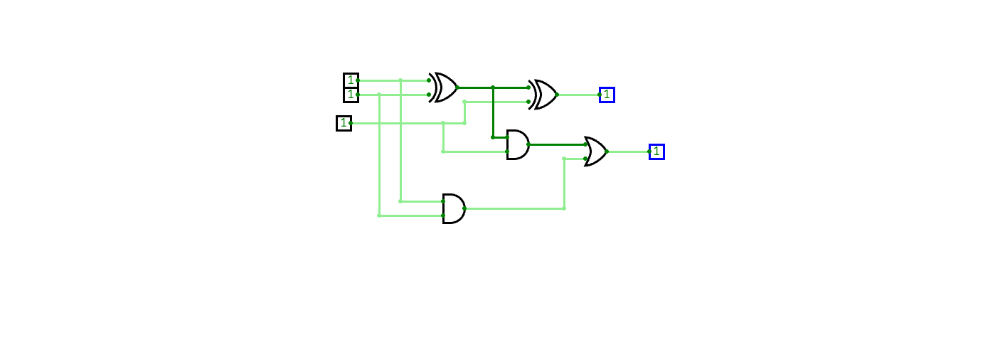
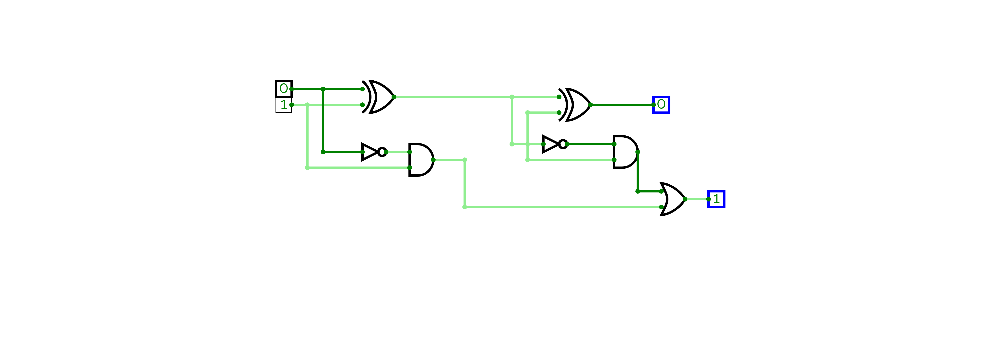

# 💻 Computer-architecture
🎓 **Register Number:** 192424081  
🤗 **NAME:** THARANKESWARAN 

># 🔢 Logic Gate Simulation  

### 1️⃣ First Logic Gate  

⚡ [Click me to run First Logic Gate Simulation](https://circuitverse.org/simulator/embed/1-269fd04f-3c4c-45c6-ba71-d7e6ebe633ac?theme=night-sky)

### 2️⃣ Second Logic Gate  

⚡ [Click me to run Second Logic Gate Simulation](https://circuitverse.org/simulator/embed/2-554b53c2-fb7a-4f43-a498-c20184201498?theme=night-sky)

### 3️⃣ Third Logic Gate  

⚡ [Click me to run Third Logic Gate Simulation](https://circuitverse.org/simulator/embed/3-52f82561-c502-44bd-922b-7aeec481ec09?theme=night-sky)

### 4️⃣ Fourth Logic Gate  

⚡ [Click me to run Fourth Logic Gate Simulation](https://circuitverse.org/simulator/embed/4-9269484d-8b28-4ded-bc55-e0b131e32eb2?theme=night-sky)
